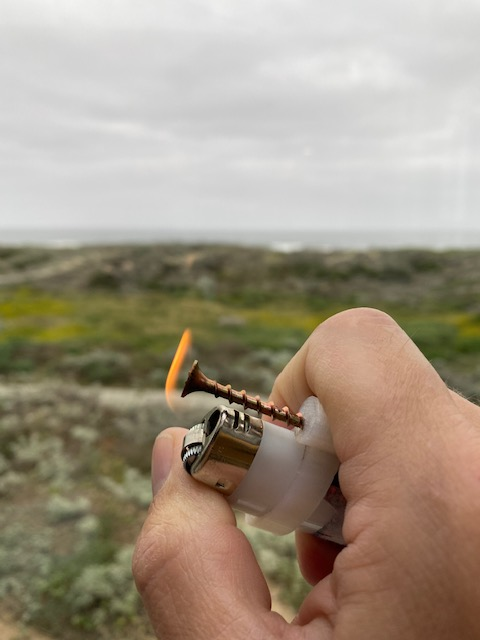

# bicky, the finger operator

Its a metal finger you can use to operate:

- elevator buttons
- gaz pump
- ATM keyboards

After using the screw head as a proxy for your finger, flick the bic and use the flame to disinfect the screw head.

rinse and repeat.

Inspired by a video clip from Hubei featured in this channel:
https://www.youtube.com/user/ChrisMartensondotcom

## step 1

## step 2

