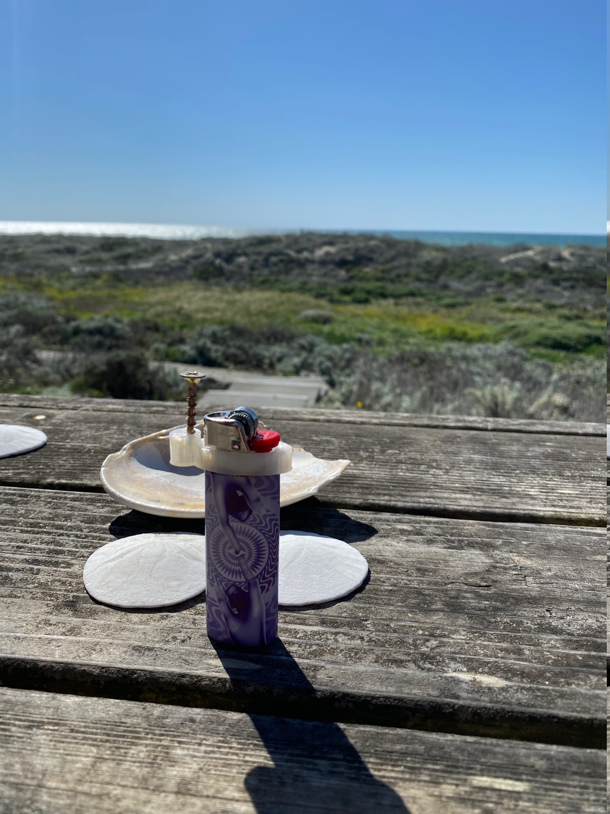

# bicky

Its a metal finger you can use to operate:

- elevator buttons
- gaz pump
- ATM keyboards

After using the screw head as a proxy for your finger, flick the bic and use the flame to disinfect the screw head.

rinse and repeat.

